# Instagram Clone (Flutter + GetX)

This is my **Instagram Clone** project built with **Flutter** and **GetX** state management.

---

## 🚀 Features
- Login / Signup 
- Home Feed & Stories
- Upload Post with Image
- Profile Page
- Camera Integration
- Dark & Light Mode
- Like / Comment / Share Posts

---

## 📱 Screenshots
<table>
<tr>
<td>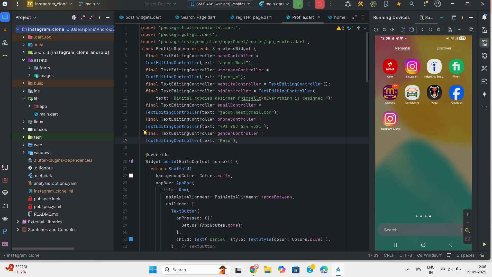</td>
</tr>

<tr>
<td>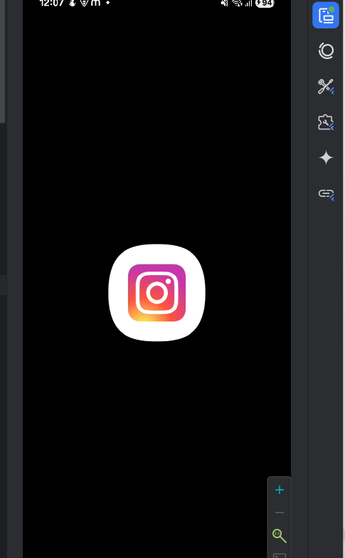</td>
</tr>

<tr>
<td>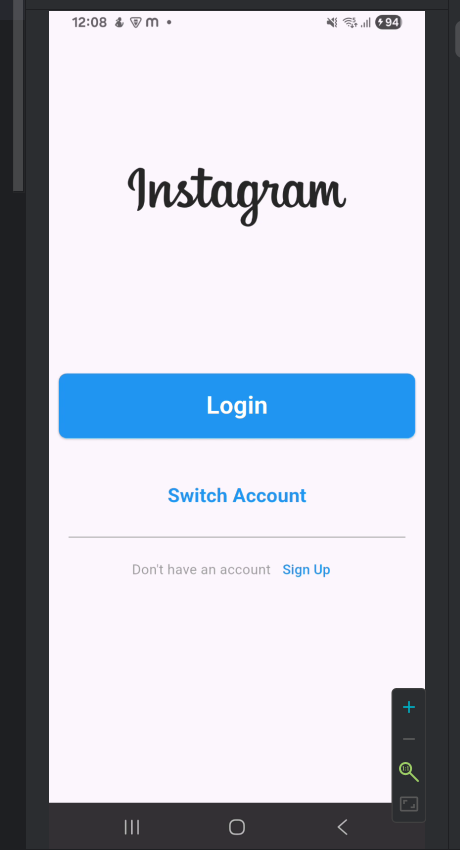</td>
</tr>

<tr>
<td>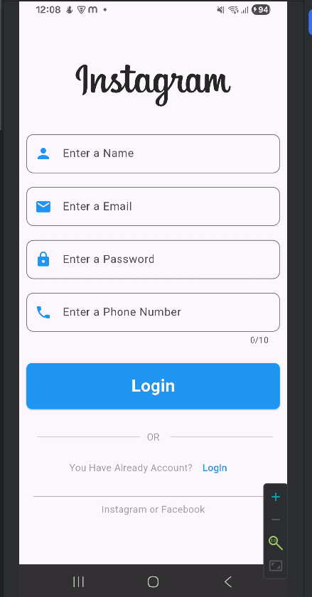</td> 
<td>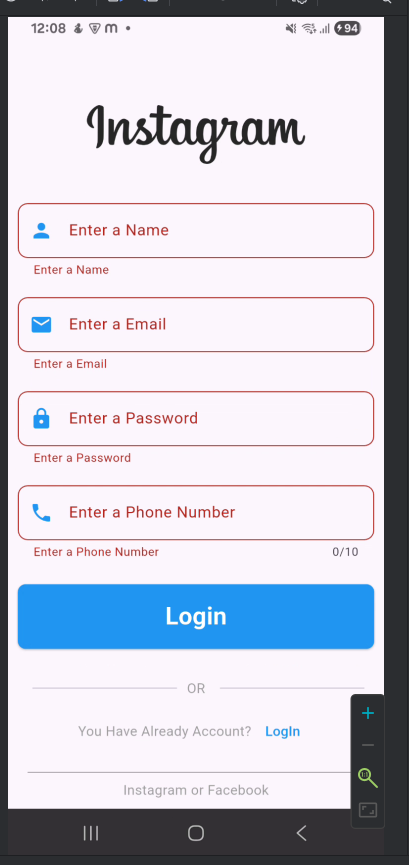</td>
</tr>

<tr>
<td>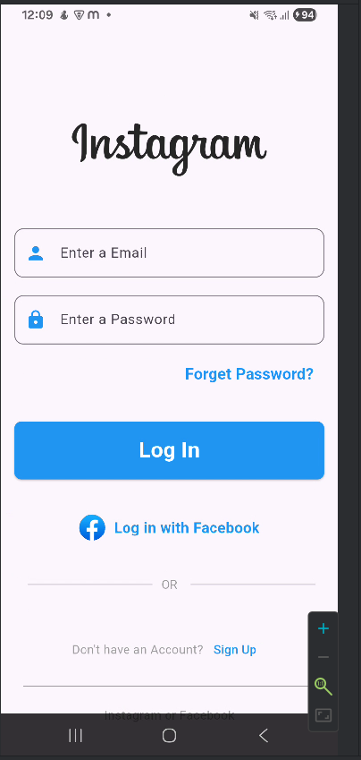</td> 
<td>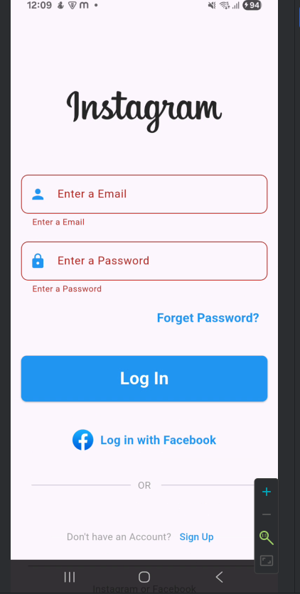</td>
</tr>

<tr>
<td>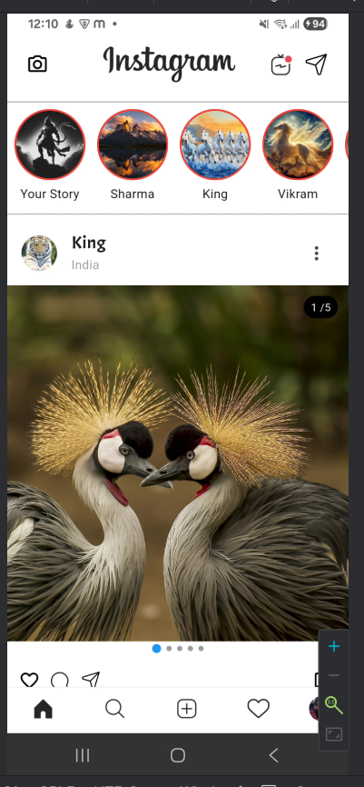</td> 
<td>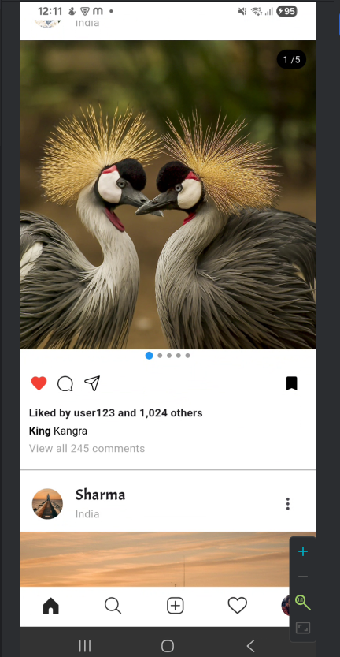</td> 
<td>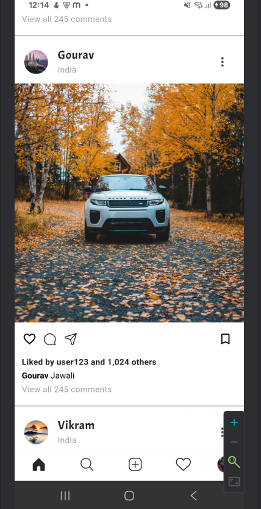</td>
</tr>

<tr>
<td>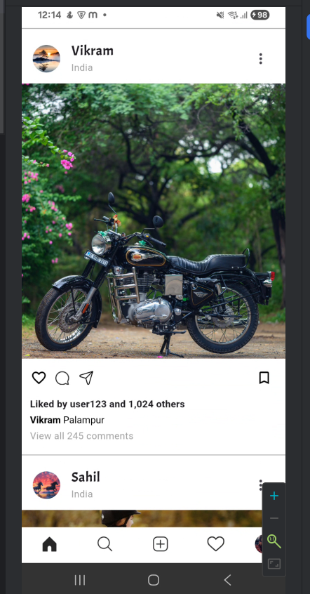</td> 
<td>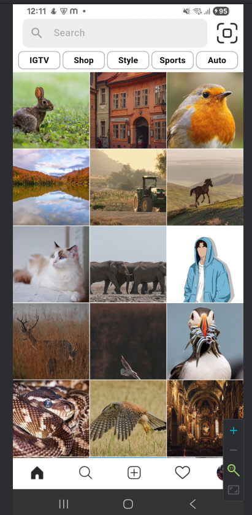</td> 
<td>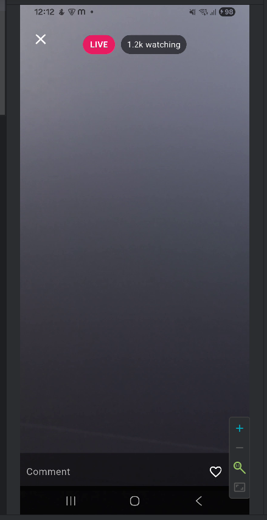</td> 
</tr>

<tr>
<td>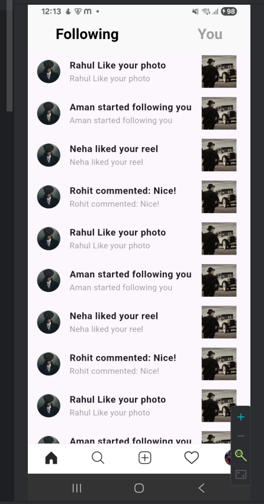</td> 
<td>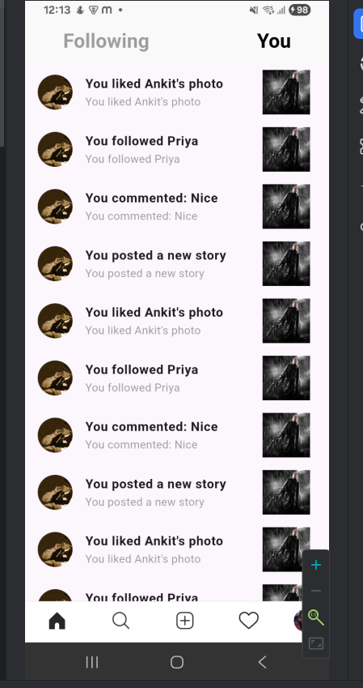</td> 
<td>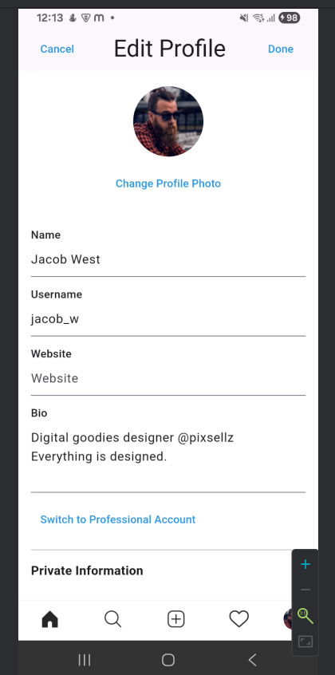</td> 
</tr>
</table>

---

## 📂 Getting Started

This project is a starting point for a Flutter application.  
If you want to run it locally, follow these steps:

1. Clone the repository:
```bash
git clone https://github.com/Prinshuls/instagram_clone.git
